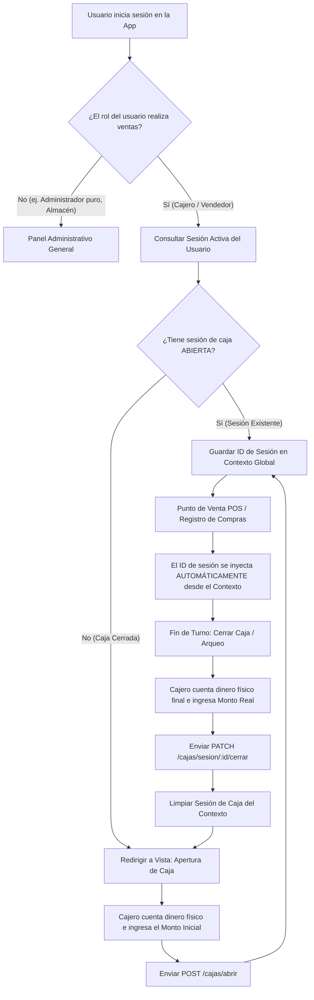

# Guía de Flujo: Lógica de Sesión de Caja (Arqueo y Turnos)

Esta guía detalla la arquitectura, el flujo de negocio y los pasos de integración para el frontend sobre cómo manejar las **Sesiones de Caja** de forma automatizada y segura en **Kantuta POS**, eliminando la necesidad de ingresar manualmente el ID de la sesión.

---

## 📌 1. Diferencia Conceptual Clave

### A. Sesión de Usuario (Login Auth)
* **Objetivo:** Autenticación e identidad (¿quién ingresa al sistema?).
* **Manejado por:** `/auth/login` (retorna JWT y datos de usuario).
* **Frecuencia:** Cada vez que expira el token o el usuario sale voluntariamente.

### B. Sesión de Caja (Turno de Trabajo)
* **Objetivo:** Arqueo de efectivo (¿cuánto dinero físico hay en la gaveta?).
* **Manejado por:** `/cajas/abrir` y `/cajas/sesion/:id/cerrar`.
* **Frecuencia:** Una vez por turno de trabajo. Requiere **conteo de efectivo inicial** (base de caja).
* **Restricción:** Solo se permiten ventas (`POST /ventas`) o egresos de compras (`POST /compras` con `pagar_con_caja: true`) si existe una **Sesión de Caja Abierta**.

---

## 🔄 2. El Flujo de Trabajo Recomendado



---

## 🛠️ 3. Endpoints de la API (Cajas)

### 3.1. Obtener Sesión Activa del Usuario
* **Método:** `GET`
* **Ruta:** `/cajas/sesion-activa/:idUsuario`
* **Respuesta (200 - Sesión Abierta):**
  ```json
  {
    "id": 12,
    "id_caja": 1,
    "monto_inicial": "100.00",
    "estado_sesion": "ABIERTA",
    "fecha_apertura": "2026-05-30T16:00:00.000Z",
    "id_usuario": 2
  }
  ```
* **Respuesta (404 / 200 null - No tiene sesión abierta):**
  Lanza un error o retorna `null` indicando que la caja está cerrada para este usuario.

### 3.2. Abrir Caja
* **Método:** `POST`
* **Ruta:** `/cajas/abrir`
* **Cuerpo:**
  ```json
  {
    "id_caja": 1,
    "monto_inicial": 150.00,
    "id_usuario": 2,
    "id_user_create": 2
  }
  ```

### 3.3. Cerrar Caja
* **Método:** `PATCH`
* **Ruta:** `/cajas/sesion/:id/cerrar`
* **Cuerpo:**
  ```json
  {
    "monto_final_real": 950.50,
    "id_user_update": 2
  }
  ```

---

## 💻 4. Estrategia de Implementación en React

### 4.1. Crear un `CajaContext` Global
Se debe proveer un contexto global para que cualquier componente (como el Punto de Venta o el formulario de compras) conozca la sesión activa actual sin pedirle al usuario digitar un número.

```typescript
// src/context/CajaContext.tsx
import React, { createContext, useContext, useState, useEffect } from 'react';
import { useAuth } from './auth/AuthContext';
import { CajasService } from '../modules/Cajas/services/cajasService';

interface CajaContextType {
  sesionActiva: any | null;
  loading: boolean;
  checkSesion: () => Promise<void>;
  abrirCaja: (idCaja: number, montoInicial: number) => Promise<any>;
  cerrarCaja: (montoFinalReal: number) => Promise<any>;
}

const CajaContext = createContext<CajaContextType | undefined>(undefined);

export const CajaProvider: React.FC<{ children: React.ReactNode }> = ({ children }) => {
  const { user } = useAuth();
  const [sesionActiva, setSesionActiva] = useState<any | null>(null);
  const [loading, setLoading] = useState(true);

  const checkSesion = async () => {
    if (!user) {
      setSesionActiva(null);
      setLoading(false);
      return;
    }
    try {
      // Hacemos una petición para ver si este usuario tiene alguna sesión activa en alguna caja
      const response = await CajasService.getSesionActivaUsuario(user.id);
      setSesionActiva(response.data || null);
    } catch (err) {
      setSesionActiva(null);
    } finally {
      setLoading(false);
    }
  };

  useEffect(() => {
    checkSesion();
  }, [user]);

  const abrirCaja = async (idCaja: number, montoInicial: number) => {
    if (!user) return;
    const response = await CajasService.abrirSesion({
      id_caja: idCaja,
      monto_inicial: montoInicial,
      id_usuario: user.id,
      id_user_create: user.id
    });
    setSesionActiva(response.data);
    return response.data;
  };

  const cerrarCaja = async (montoFinalReal: number) => {
    if (!sesionActiva || !user) return;
    const response = await CajasService.cerrarSesion(sesionActiva.id, {
      monto_final_real: montoFinalReal,
      id_user_update: user.id
    });
    setSesionActiva(null);
    return response.data;
  };

  return (
    <CajaContext.Provider value={{ sesionActiva, loading, checkSesion, abrirCaja, cerrarCaja }}>
      {children}
    </CajaContext.Provider>
  );
};

export const useCaja = () => {
  const context = useContext(CajaContext);
  if (!context) throw new Error('useCaja debe usarse dentro de CajaProvider');
  return context;
};
```

### 4.2. Bloqueo Automático en Vistas POS (`PuntoDeVenta.tsx`)
En vez de mostrar un input de `ID Sesión de Caja Activa`, el POS comprueba el contexto:

```tsx
const PuntoDeVenta = () => {
  const { sesionActiva, loading } = useCaja();
  const navigate = useNavigate();

  useEffect(() => {
    if (!loading && !sesionActiva) {
      // Si la caja no está abierta, redirigimos al control de cajas para que la abra
      alert("Atención: Debe abrir un turno de caja antes de realizar ventas.");
      navigate("/cajas");
    }
  }, [sesionActiva, loading]);

  // Al realizar el cobro, inyectamos automáticamente el ID
  const handleCheckout = async () => {
    if (!sesionActiva) return;
    const payload: CrearVentaRequest = {
      metodo_pago: metodoPago,
      id_sesion_caja: sesionActiva.id, // <-- INYECTADO AUTOMÁTICAMENTE
      detalles: cart.map(...),
      id_user_create: user.id
    };
    ...
  };
}
```
